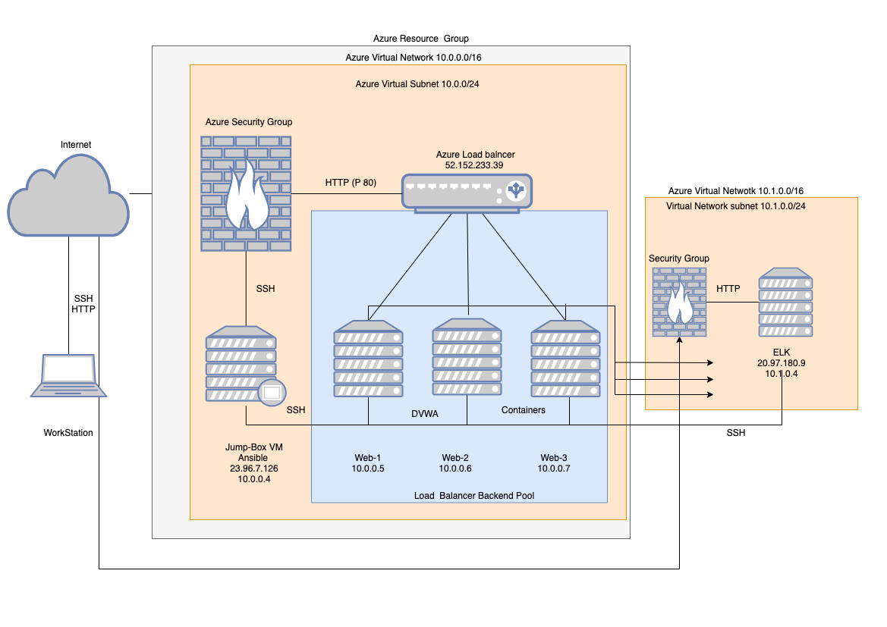
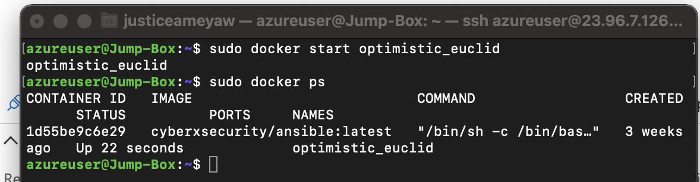

## Automated ELK Stack Deployment

The files in this repository were used to configure the network depicted below.

These files have been tested and used to generate a live ELK deployment on Azure. They can be used to either recreate the entire deployment pictured above. Alternatively, select portions of the ymlfiles playbooks file may be used to install only certain pieces of it, such as Filebeat.

  - 
  - 

This document contains the following details:
- Description of the Topology
- Access Policies
- ELK Configuration
  - Beats in Use
  - Machines Being Monitored
- How to Use the Ansible Build

### Description of the Topology

The main purpose of this network is to expose a load-balanced and monitored instance of DVWA, the D*mn Vulnerable Web Application.

Load balancing ensures that the application will be highly , in aavailable ddition to restricting  to t inbound access the network.
- What aspect of security do load balancers protect? What is the advantage of a jump box? 
The load balancer ensures that work to process incoming traffic will be shared by both vulnerable web servers.
Access controls will ensure that only authorized users — namely, ourselves — will be able to connect in the first place.

Integrating an ELK server allows users to easily monitor the vulnerable VMs for changes to the file systemof the VMs on the network and system metrics.
- What does Filebeat watch for? 
Filebeat monitors the log files or locations that you specify, collects log events, and forwards them either to Elasticsearch or Logstash for indexing
-  What does Metricbeat record?
Metricbeat takes the metrics and statistics that it collects and ships them to the output that you specify, such as Elasticsearch or Logstash.

The configuration details of each machine may be found below.

| Name     | Function    | IP Address | Operating System |
|----------|-------------|------------|------------------|
| Jump Box | Gateway     | 10.0.0.4   | Linux            |
| DVWA 1   | Web Server  | 10.0.0.5   | Linux            |
| DVWA 2   | Web Server  | 10.0.0.6   | Linux            |
| DVWA 3   | Web Server  | 10.0.0.7   | Linux            |
| ELK      | Monitoring  | 10.1.0.4   | Linux            |

### Access Policies

The machines on the internal network are not exposed to the public Internet. 

Only the Jump box machine can accept connections from the Internet. Access to this machine is only allowed from the following IP addresses:
- 66.41.202.227

Machines within the network can only be accessed by each other.

A summary of the access policies in place can be found in the table below.

|   Name   | Publicly Accessible   |  Allowed IP Addresses  |
|:--------:|:---------------------:|:----------------------:|
| Jump Box |          yes          |      66.41.202.227     |
|    ELK   |           No          | 10.1.0.4 , 20.97.180.9 |
|   DVWA1  |           No          |        10.0.0.5        |
|   DVWA2  |           No          |        10.0.0.6        |
|   DVWA3  |           No          |        10.0.0.7        |

### Elk Configuration

Ansible was used to automate configuration of the ELK machine. No configuration was performed manually, which is advantageous because...
- selects machines to execute against from inventory
- connects to those machines (or network devices, or other managed nodes), usually over SSH
- copies one or more modules to the remote machines and starts execution there

The playbook implements the following tasks:
- Checks hosts file for Elk Server IP, sets remote username, runs as root
- Installs docker.io
- Installs pip3 and uses pip3 to install docker python module
- Increase virtual memory
- Download and launch a docker elk container

The following screenshot displays the result of running `docker ps` after successfully configuring the ELK instance.

### Target Machines & Beats
This ELK server is configured to monitor the following machines:

- 10.0.0.5  Web-1
- 10.0.0.6  Web-2
- 10.0.0.7  Web-3

We have installed the following Beats on these machines:
- Filebeat
- Metricbeat

These Beats allow us to collect the following information from each machine:
- Filebeat: Filebeat detects changes to the filesystem. Specifically, we use it to collect Apache logs.
- Metricbeat: Metricbeat detects changes in system metrics, such as CPU usage. We use it to detect SSH login attempts, failedsudo      escalations, and CPU/RAM statistics.

### Using the Playbook
In order to use the playbook, you will need to have an Ansible control node already configured. 

SSH into the control node jump box and follow the steps below:
- Copy the playbooks file to /etc/ansible.
- Update the hosts file to include web servers and ELK server IP address
$ cd /etc/ansible
$ cat > hosts <<EOF
[webservers]
10.0.0.5 ansible_python_interpreter=/usr/bin/python3 
10.0.0.6 ansible_python_interpreter=/usr/bin/python3 
10.0.0.7 ansible_python_interpreter=/usr/bin/python3 
[elk] 
10.1.0.4 ansible_python_interpreter=/usr/bin/python3 
EOF

- Run the playbook, and navigate to curl http://52.152.233.39/setup.php to see if the installation worked as expected.

- _Which file is the playbook? Where do you copy it?
- Filebeat playbook
- Metricbeat playbook
- Install ELK playbook

Copy in /etc/ansible/ directory 

- _Which file do you update to make Ansible run the playbook on a specific machine?

update /etc/ansible/hosts

How do I specify which machine to install the ELK server on versus which to install Filebeat on?

Specify by the IP address 10.1.0.4

- _Which URL do you navigate to in order to check that the ELK server is running?

curl http://20.97.180.9:5601/app/kibana#/home 

